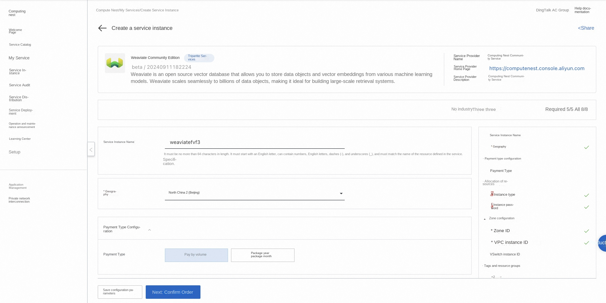
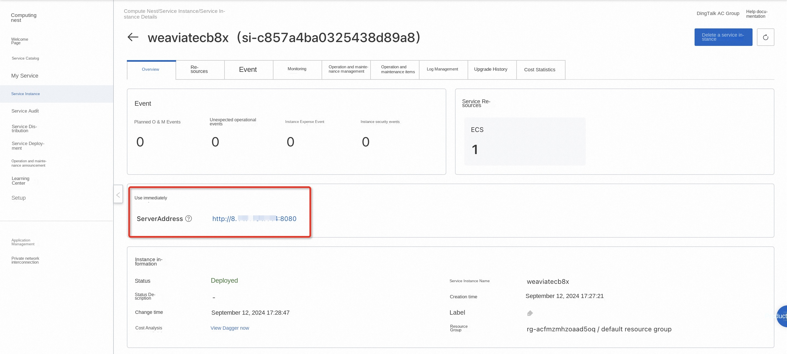
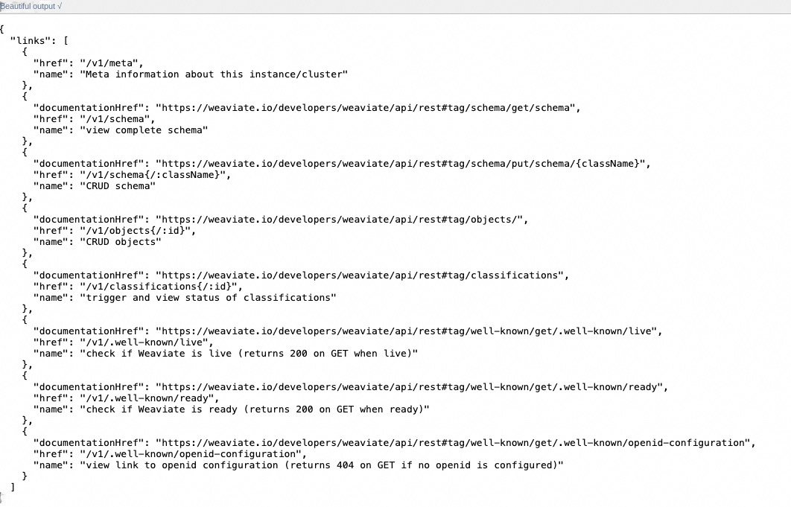
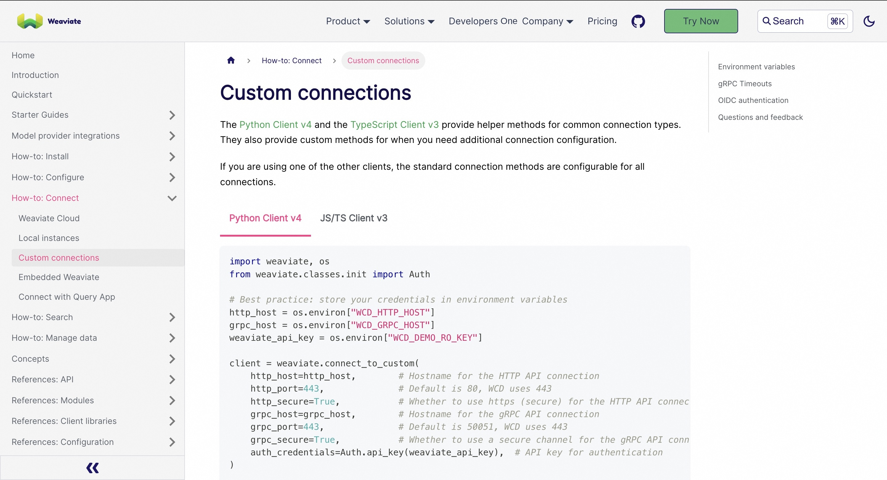

# Weaviate Community Edition Quick Deployment

## Overview
Weaviate allows you to quickly set up a public and private network disk system. Weaviate supports different cloud storage platforms at the bottom, users do not need to care about physical storage methods in actual use. You can use Weaviate to build personal internet disks, file sharing systems, or public cloud systems for large and small groups. For details, please see [Weaviate official website](https://weaviate.io/developers/weaviate/connections/connect-cloud).

## Billing Description
Fees on the Weaviate Community Edition mainly relate:

-Selected vCPU and memory specifications
-System disk type and capacity
-public network bandwidth

## Permissions required for RAM accounts
To deploy Weaviate Community Edition, you need to access and create some Alibaba Cloud resources. Therefore, your account must contain permissions for the following resources.
**Note**: This permission is required only when your account is a RAM account.

| Permission policy name | Comment |
| ------------------------------------- | ---------------------------- |
| AliyunECSFullAccess | Permissions to manage ECS instances |
| AliyunVPCFullAccess | Permissions to manage a VPC |
| AliyunROSFullAccess | Manage permissions for Resource Orchestration Service (ROS) |
| AliyunComputeNestUserFullAccess | Manage user-side permissions for the compute nest service (ComputeNest) |

## Deployment process
1. Visit the Weaviate Community Edition Service [Deployment Link](https://computenest.console.aliyun.com/service/instance/create/cn-hangzhou?type=user&ServiceId=service-c6622482694448288847) and fill in the deployment parameters as prompted:

2. After completing the parameters, you can see the corresponding RFQ details. After confirming the parameters, click **Next: Confirm Order**. Confirm the order and agree to the service agreement and click **Create Now** to enter the deployment phase.

3. After the deployment is complete, enter the service instance management and find the Weaviate service access link in the console.

4. Click the link to access the service. Refer to [Documentation](https://weaviate.io/developers/weaviate/connections/connect-custom) to use the client to access the service.

